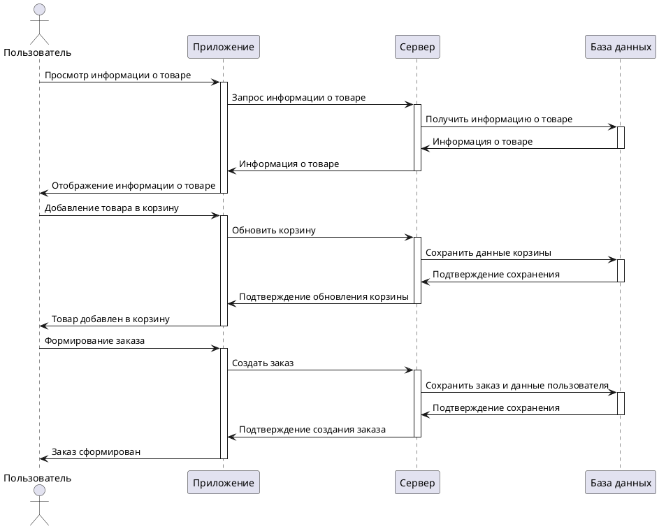
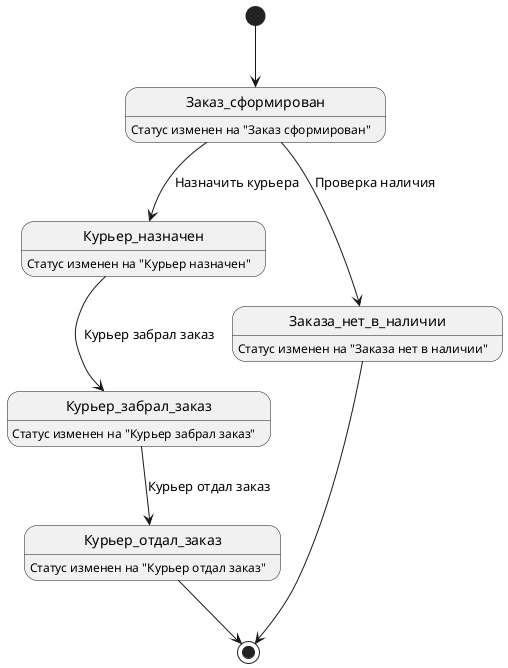
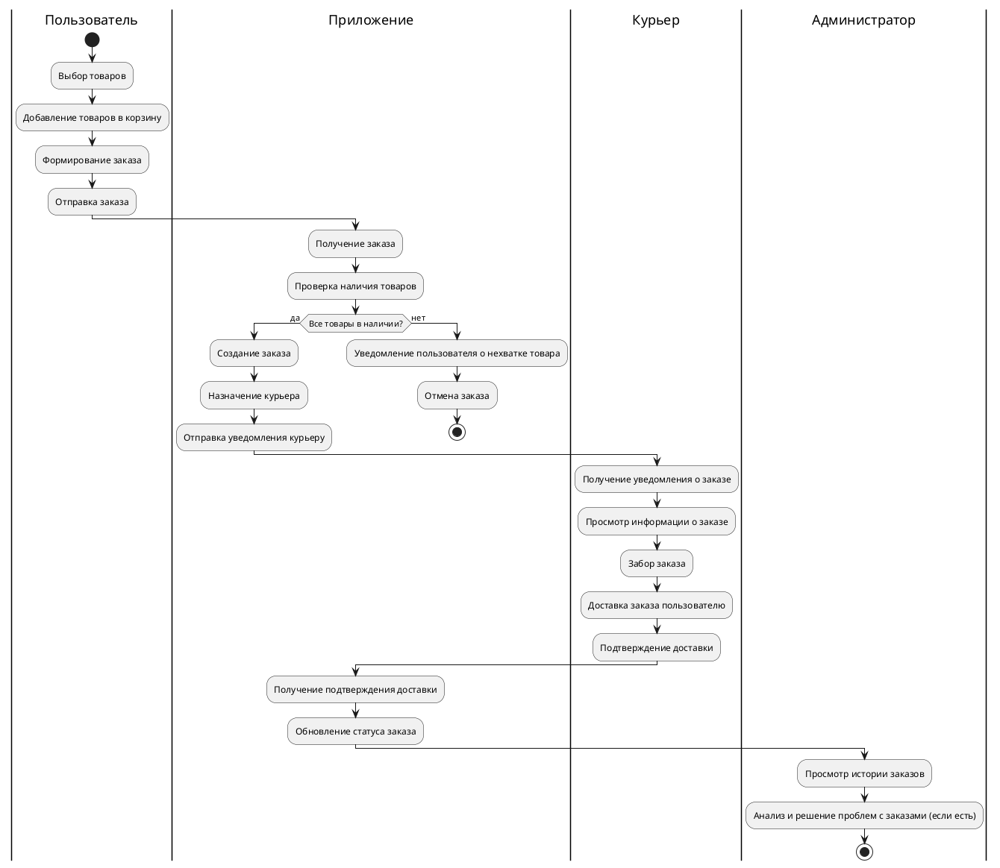
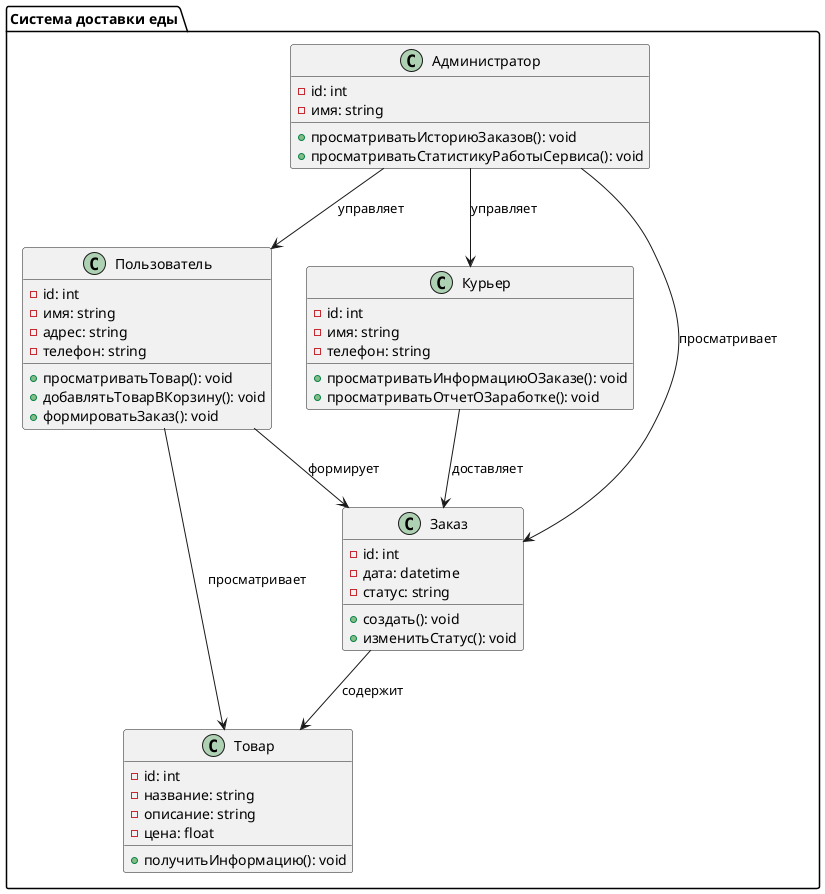

# About
Система доставки еды представляет собой комплексный сервис, включающий три роли: Администратор, Пользователь и Курьер.

### Пользователь
Пользовательская часть системы ориентирована на удобство и интуитивность. Пользователь может просматривать ассортимент доступных товаров, детально изучать информацию о каждом продукте, включая описание, цену и отзывы. После выбора нужных товаров пользователь добавляет их в корзину, где можно корректировать количество и наименование товаров. Завершив выбор, пользователь формирует заказ, указывая адрес доставки и способ оплаты. Также пользователь может отслеживать статус своего заказа в реальном времени и получать уведомления о текущем состоянии доставки.

### Курьер
Курьерская часть системы предназначена для упрощения работы курьеров. Курьеры могут видеть список назначенных им заказов, просматривать детальную информацию о каждом заказе, включая адрес доставки и контактную информацию пользователя. После успешной доставки курьер отмечает заказ как выполненный. Также у курьеров есть доступ к отчетам о выполненных заказах, где отображается сумма заработанных денег за каждый выполненный заказ. Это позволяет курьерам легко отслеживать свой доход и планировать рабочее время.

### Администратор
Администратор играет ключевую роль в обеспечении качества сервиса и решении возникающих проблем. Администратор имеет доступ к истории заказов всех пользователей и курьеров, что позволяет анализировать и решать проблемы, связанные с доставкой. Например, если возникли задержки или недовольство клиента, администратор может оперативно выяснить причины и принять меры для их устранения. Кроме того, администратор может просматривать статистику работы сервиса, включая количество выполненных заказов, среднее время доставки, оценки пользователей и другие важные показатели. Это помогает в стратегическом планировании и улучшении качества сервиса.

# Use case

```
@startuml
left to right direction
actor "Пользователь" as User
actor "Курьер" as Courier
actor "Администратор" as Admin

rectangle DeliverySystem {
    User --> (Просмотр информации о товаре)
    User --> (Добавление товара в корзину)
    User --> (Формирование заказа)

    Courier --> (Просмотр информации о заказе)
    Courier --> (Просмотр отчета о заработке)

    Admin --> (Просмотр истории заказов)
    Admin --> (Просмотр статистики работы сервиса)
}

@enduml
```
# Sequence diagram



# Диаграмма состояний




# Activity diagram




# Диаграмма классов



